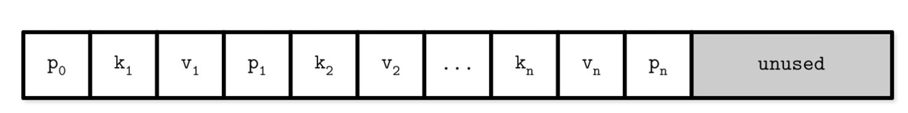
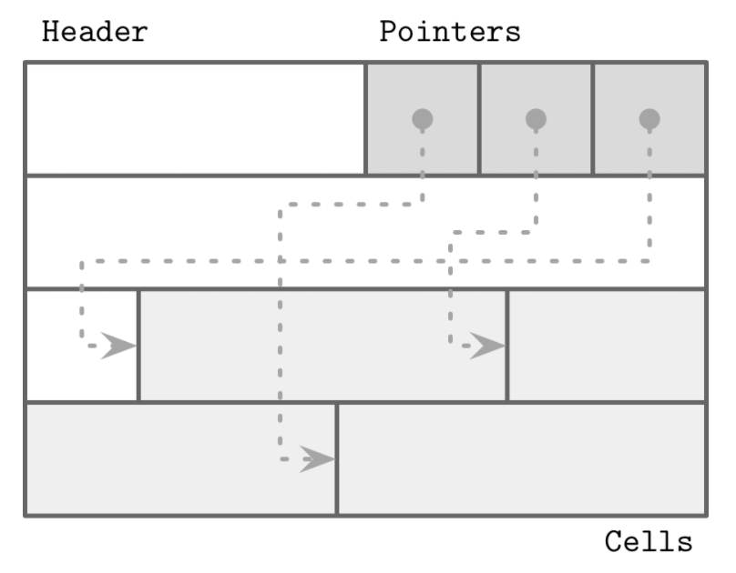

## 前言

读《数据库系统内幕》有感，个人感觉分槽页是个很难理解的概念，也是很实用的知识。

## 正文

原始的B树论文描述了一种简单的，用于定长数据的页组织方式：

这种页有这样两个缺点

- 除非往最右侧插入数据，否则需要移动前面的数据
- 无法有效地管理变长地字段

所以这里自然而然地思考，因为要存储变长的数据。

变长的数据需要回收。

回收完的数据需要移动。

但是对外的偏移量不能变，这个变动会非常麻烦，至少聚簇索引需要变动，根据实现不同，甚至二级索引也要跟着更新

我们的需求是

- 最小开销存储变长记录
- 回收已删除记录占用地空间
- 引用页中地记录，无论记录在哪

分槽页通过加了一层结构，页外指针的引用都通过前面的指针引用，包括二分查找也通过前面的指针引用，来解决这个问题。如果不涉及页的变动，一切变化都在分槽页内完成。

分槽页如何解决上述问题：

- 最小开销：分槽页唯一的额外开销是一个指针数组，用于保存记录实际所在位置的偏移量
- 空间回收：通过对页进行碎片整理和重写，就可以回收空间
- 动态布局：从页外部，只能通过槽ID来引用槽，而确切的位置是由页内部决定的
